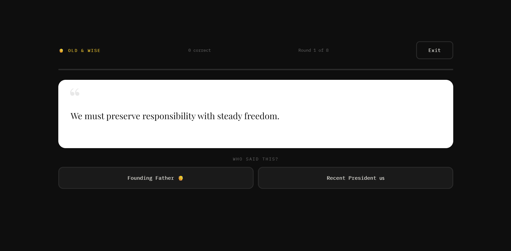

# Just Quoting…

> *Don't blame us. We're just quoting.*

A quote guessing game where you read a real quote and have to guess which of two
unhinged sources actually said it. The twist: real people are often more
unhinged than you'd expect — and the game is built to prove it.

---

## What It Does

Pick a game mode, read a quote, and guess who said it. 8 rounds per game, with
a running score and a personalized roast at the end based on how you did.

The difficulty is hard but fair — you can figure it out sometimes, but the
quotes are specifically chosen because they blur the line between the two
options. That's the whole joke.

---

## Game Modes

### 🎤 Ye or Nay
Kanye West quotes pulled live from the Kanye REST API go head to head against
real quotes from history's greatest philosophers — Nietzsche, Sartre,
Kierkegaard, Schopenhauer, Socrates, and Aristotle. The unsettling part is how
often Kanye sounds like the philosopher and not the other way around.

### 👴 Old & Unhinged *(fan favorite)*
A Founding Father vs. a Recent President (1990s or earlier). Both of them held
enormous power. Both of them said things that have absolutely no business
sounding as unhinged as they do. This is the funniest mode in the game —
history class never prepared you for how much these quotes blur together.

### 🧘 Woo Woo
Real inspirational quotes fetched live from the Quotable API go up against
AI-generated word soup. The real quotes come from people like Deepak Chopra and
Eckhart Tolle. The fake quotes are things like "the river does not rush, the
river does not wait, the river simply rivers." Good luck telling them apart.

---

## Technical Details

### APIs Used
- **Kanye REST API** — https://api.kanye.rest
  Random Kanye West quotes. No API key required.
- **Quotable API** — https://api.quotable.io
  Inspirational and philosophical quotes with author attribution. No API key
  required.

### Features
- Fetches live data from two external APIs using `fetch()` and `async/await`
- Loading spinner displays while API calls resolve
- Graceful error handling — if an API fails, the game falls back to a curated
  hardcoded pool and never crashes
- Unique deck system built per game session — no quote appears twice in the
  same 8 rounds
- localStorage tracking prevents the same quotes from repeating across
  multiple games
- Guaranteed 50/50 source distribution per game (4 quotes from each side)
  so the correct answer is never predictable
- Responsive design across phone, tablet, and desktop using CSS Grid, clamp(),
  and breakpoints at 850px and 500px
- Exit button lets players quit mid-game and return to mode select
- Final score screen with a personalized roast for every score range

### Built With
- HTML, CSS, JavaScript — single file, no frameworks
- Google Fonts (Bebas Neue, Playfair Display, IBM Plex Mono)
- CSS Grid and custom properties throughout
- localStorage for cross-session quote memory

---

## Live Site

🔗(https://kmorgan37.github.io/Mini-Project-3/just-quoting/)

## Screenshot

---

## What I Learned

Working with real APIs taught me that the hardest part isn't writing the fetch
call — it's handling everything that can go wrong after it. API response formats
change between endpoints, requests fail without clear errors, and the data
doesn't always come back the way the documentation suggests. Building solid
fallbacks ended up being just as important as the fetch itself.

The other big lesson was about game state. Managing what round you're on, which
source a quote came from, which button is correct, and preventing duplicate
quotes across rounds all had to work together without breaking each other.
The 50/50 distribution bug — where some modes would deal all 8 quotes from
the same source — took the most debugging to fix and taught me a lot about
thinking through logic before writing it.

One thing I'd continue working on with more time is fully solving the quote
redundancy issues that some modes still occasionally produce. I made significant
progress — building the deck system, adding localStorage tracking, and improving
the quote pool templates — but completely eliminating near-duplicate quotes
would require more experience with APIs and a deeper understanding of filtering
and deduplicating dynamic data at the source level.
